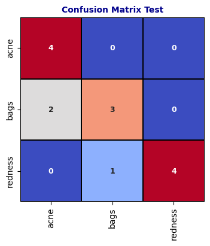

# Vision Transformer Classification Model

This project implements a **Vision Transformer (ViT)** model for image classification tasks. The model has been trained and evaluated, and this repository includes the corresponding training curves and performance metrics such as the confusion matrix and loss graph.

## Table of Contents
1. [Model Overview](#model-overview)
2. [Model Architecture](#model-architecture)
3. [Training Process](#training-process)
4. [Visualizations](#visualizations)
5. [How to Run](#how-to-run)
6. [Results](#results)
7. [Dependencies](#dependencies)
8. [Credits](#credits)

---

## Model Overview
The Vision Transformer (ViT) model is used for **image classification** tasks. It replaces traditional convolutional neural networks (CNNs) with a transformer-based approach, allowing it to process image patches as sequences and extract features efficiently.

**Key Features**:
- Model: Vision Transformer Base (ViT-B/16)
- Preprocessing: Image resizing, normalization, and tensor conversion.
- Loss: CrossEntropyLoss.
- Metrics: Accuracy and Loss (Training and Validation).
- Inference: Softmax is used to generate class probabilities.

---

## Model Architecture
The model uses **ViT-B/16** (a base Vision Transformer model with patch size 16) as its backbone. The classification head is modified to match the number of classes in the dataset:

- Input Image Size: `224x224`
- Transformer Backbone: `vit_b_16`
- Linear Classification Head: Outputs logits matching the target class count.

The custom classification head is defined as:
```python
loaded_model.heads = nn.Sequential(OrderedDict([
    ('head', nn.Linear(in_features=768, out_features=num_classes))
]))
```

---

## Training Process
1. **Dataset Preparation**: Images are transformed using the following pipeline:
   - Resize to `224x224`.
   - Convert to tensor.
   - Normalize using standard ImageNet mean and standard deviation values.

2. **Loss Function**: CrossEntropyLoss is used to compute the loss between predictions and true labels.

3. **Performance Metrics**: Accuracy and Loss for training and validation datasets.

4. **Optimization**: The optimizer and learning rate scheduler are applied to enhance convergence.

5. **Checkpointing**: The best-performing model is saved to a checkpoint file.

---

## Visualizations
The following visualizations are provided to evaluate the model's performance:

### 1. Confusion Matrix
The confusion matrix highlights the classification performance across all classes:



### 2. Training and Validation Loss Graph
The training and validation loss curves demonstrate how the model converges over epochs:


---

## How to Run
1. **Clone this repository**:
   ```bash
   git clone https://github.com/ahmedansari9548/SkinSync/Classification/Base_Model
   cd <repo-directory>
   ```
2. **Install dependencies**:
   ```bash
   pip install -r requirements.txt
   ```
3. **Run the notebook**:
   Use Jupyter Notebook or any compatible IDE to run `Classification_Base_Model.ipynb`.
4. **Perform Inference**:
   Replace `image_path` with your input image:
   ```python
   image_path = "path/to/image.jpg"
   predicted_class = predict_image(image_path)
   print(f"Predicted class: {predicted_class}")
   ```

---

## Results
The Vision Transformer model achieved the following results:
- **Best Loss**: 0.5469860633456847
- **Epoch**: 3
- **Best Metric**: 0.9230769230769231

---

## Dependencies
- Python 3.8+
- PyTorch
- Torchvision
- PIL
- NumPy
- Matplotlib

Install all dependencies using the following command:
```bash
pip install -r requirements.txt
```

---

## Credits
This project leverages the Vision Transformer model from PyTorch's `torchvision.models` library.

