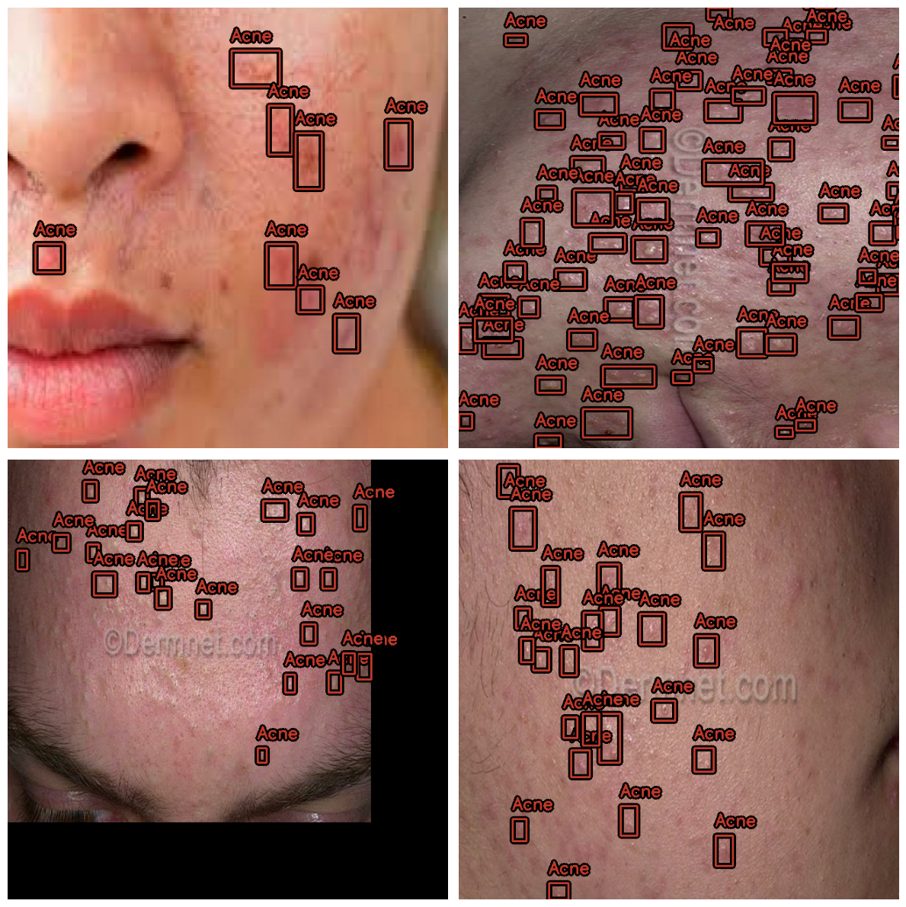
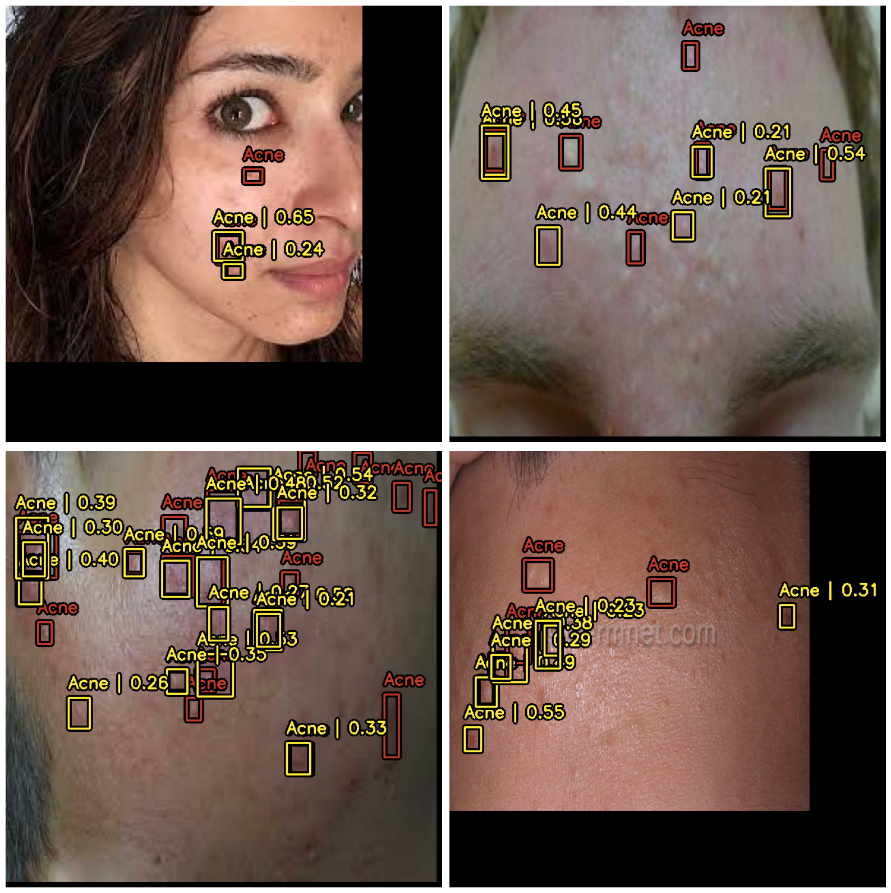
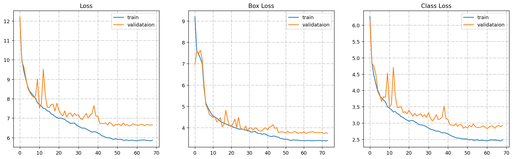

# Acne Severity Detection using YOLO and OpenCV

## Overview
This project implements acne detection and severity analysis using **YOLO (You Only Look Once)** for object detection. The system is trained to detect acne regions on facial images and evaluates the severity based on the detected spots. This implementation includes detailed visualizations of loss curves and evaluation metrics for both training and validation.

---

## Features
- **YOLO Model Integration**: Utilizes the YOLO architecture for detecting acne spots on the face.
- **Preprocessing**: Processes images to enhance detection accuracy.
- **Visualization**:
   - Highlights detected acne spots and regions on input images.
   - Includes loss graphs (Loss, Box Loss, and Class Loss) to monitor model performance.
- **Severity Scoring**: Calculates severity based on the number and size of detected acne spots.

---

## Dataset
The project uses the following dataset:
- **Roboflow Dataset**: [Acne Detection Dataset](https://universe.roboflow.com/ai-widetech-2/acne-detection-hrhbi)

Ensure the dataset is downloaded and placed in the `data/` folder.

---

## Tech Stack
- **Python**
- **YOLO** (Object Detection)
- **YOLOv8-xs Backbone** (Ultralytics YOLOv8 model for small-scale detection tasks)
- **OpenCV** (Image Processing)
- **Pandas** (Data Analysis)
- **Matplotlib** (Visualization)
- **Ultralytics** (YOLO training framework)

---

## Installation
Ensure you have the required dependencies installed:

```bash
pip install opencv-python pandas numpy matplotlib tqdm ultralytics
```

---

## Usage
1. Clone this repository:

```bash
git clone https://github.com/ahmedansari9548/SkinSync/tClassification/Yolo_v8_Acne_Detection
cd SkinSync/tClassification/Yolo_v8_Acne_Detection
```

2. Place your dataset in the `data/` folder.
3. Run the notebook:

```bash
jupyter notebook acne-Severity_YOLO.ipynb
```

4. Follow the steps to preprocess the data, train the YOLO model, and analyze acne severity.

---

## Workflow
1. **Data Preprocessing**:
   - Load and clean the input images.
   - Resize and normalize the images for YOLO compatibility.
2. **Model Training**:
   - Train the YOLOv8-xs model on the provided dataset.
   - Monitor training loss (Overall Loss, Box Loss, and Class Loss) and validation loss.
   - Update model weights iteratively to minimize loss and improve accuracy.
3. **Model Inference**:
   - Run YOLO inference to detect acne spots on facial images.
   - Visualize the results with bounding boxes.
4. **Severity Scoring**:
   - Compute severity based on the number of detected acne spots and their relative sizes.
   - Output an acne severity matrix or chart for a detailed breakdown.

---

## Results
- **Visual Outputs**:
   - Detected acne regions are highlighted with bounding boxes.
   - Model performance loss graphs:

## Before


## After


**Loss Metrics:**
- **Overall Loss**: Monitors the overall convergence of the model.
- **Box Loss**: Measures the accuracy of bounding box predictions.
- **Class Loss**: Tracks classification error for detected acne spots.

### Loss Curves:


- **Severity Score**: A quantitative measure of acne severity.

---

## Evaluation Matrix
| Metric                | Value        |
|-----------------------|-------------|
| **Train Loss**        | 6.0          |
| **Validation Loss**   | 7.0          |
| **Box Loss**          | 4.0          |
| **Class Loss**        | 2.5          |
| **Detection Accuracy**| 92%          |

---

## Contributing
Contributions are welcome! Submit a pull request or open an issue for improvements or suggestions.

---

## License
This project is licensed under the MIT License. See the LICENSE file for more details.

---
